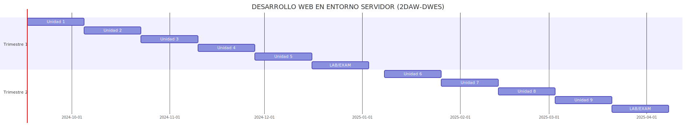

# MÓDULO DE DESARROLLO WEB EN ENTORNO SERVIDOR (DWES)

* El módulo de “Desarrollo web en entorno servidor” correspondiente al Ciclo Formativo de Grado Superior
“Desarrollo de Aplicaciones Web”, pertenece a la Formación Profesional Reglada, y está regulado por el
Real Decreto 686/2010, de 20 de Mayo (BOE 12 de junio de 2010), en lo que se refiere al Título y sus
enseñanzas mínimas.

* El Decreto 1/2011, de 13 de enero (BOCM de 31 de enero de 2011), establece para la Comunidad de Madrid
el currículo de ciclo formativo de grado superior correspondiente al título de Técnico Superior en Desarrollo
de Aplicaciones Web.

Las cualificaciones y unidades de competencia propias de este módulo son:
* Desarrollo de aplicaciones con tecnologías web IFC154_3 (Real Decreto 1087/2005, de 16 de septiembre), que comprende las siguientes unidades de competencia:
    - UC0491_3 Desarrollar elementos software en el entorno cliente.
    - UC0492_3 Desarrollar elementos software en el entorno servidor.
    - UC0493_3 Implementar, verificar y documentar aplicaciones web en entornos internet, intranet y
    extranet

El referente internacional o CINE/ISCED es CINE-5b y el europeo o EFQ-MEC es 5.

> La duración del módulo es de 180 horas lectivas, a razón de 9 horas semanales impartidas durante los dos
primeros trimestres del segundo curso del ciclo. Se imparte íntegramente en el centro educativo

# PROFESOR, TUTOR Y TUTOR FCT

- Nombre: Iván Jiménez U.
- correo: [ivan.jimenez18@educa.madrid.org](mailto:ivan.jimenez18@educa.madrid.org)

# CONTENIDOS - UNIDADES DE TRABAJO

1. MODELOS DE ARQUITECTURAS WEB, LENGUAJES, FRAMEWORKS Y HERRAMIENTAS
2. PROGRAMACIÓN EN ENTORNOS SERVIDOR. LENGUAJE DE ENTORNO SERVIDOR.
3. PROGRAMACIÓN EN ENTORNOS DE SERVIDOR II. ACCESO A DATOS Y CICLO COMPLETO DE DESARROLLO Y DESPLIEGUE.
4. AUTENTICACIÓN Y CONTROL DE ACCESO
5. ARQUITECTURA MVC. OTRAS ARQUITECTURAS.
6. MAPEADORES DE OBJETO-RELACIONALES
7. PROGRAMACIÓN REACTIVA Y DE ALTO RENDIMIENTO. ASYNC Y THREADS.
8. SERVICIOS WEB, MICROSERVICIOS Y SISTEMAS DISTRIBUIDOS. 

# CRONOGRAMA

# METODOLOGÍA

- Contenidos teóricos y prácticos dados en clase en Aula Virtual 
- Muestras de código (live coding), ejercicios propuestos, laboratorios y pequeños proyectos
- Uso de aulavirtual 
- Uso de github y otras herramientas de repositorios
- Microsoft Visual Studio 2022, .NET 8 SDK, C# 
- SQL Server, PostgresSQL, EntityFramework
- Docker
- Azure, Kubernetes.

# CRITERIOS DE CALIFICACIÓN
- A definir...
    - Prueba Objetiva cada trimestre con un porcentaje
    - Prácticas y pequeñas pruebas a lo largo del trimestre que será otro porcentaje
    - Final Ordinario y Final Extraordinario
    - Mínima calificación en cada parte y/o trimestre

# ORDINARIA Y EXTRAORDINARIA

- Alumnos con pérdida de continua tendrán el derecho de presentarse tanto al Ordinario como al Extraordinario en un examen completo teórico práctico.

- Recuperación de evaluaciones pendientes y prueba extraordinaria: La recuperación de las evaluaciones pendientes se realizará en la prueba objetiva ordinaria, donde los alumnos que no hayan perdido la evaluación continua solo se examinarán de las evaluaciones pendientes.

- En la convocatoria extraordinaria se examinarán de todo el contenido de la materia.
    
# EVALUACIONES

* 1EVALUACIÓN: 
    - 2, 3 Y 4 DICIEMBRE TODOS LOS CURSOS
    - 5 DE DICIEMBRE: ENTREGA DE NOTAS

* 2EVALUACIÓN:
    - FP/2BACH: 24 FEBRERO
    - INICIO FCT: FINALES FEBRERO O MARZO

* 3EVALUACIÓN:
    - EXTRAORDINARIA: 18 JUNIO

# Actividades extraescolares y complementarias previstas
- Feria del Empleo

# Evaluación de la práctica docente

- Para evaluar la práctica docente, de forma opcional, cada profesor podrá realizar encuestas anónimas a los alumnos para recabar más información que le pueda ayudar a la mejora de sus procedimientos.

# ACTIVIDADES

* [Feria de Empleo](https://customervoice.microsoft.com/Pages/ResponsePage.aspx?id=SJ5RaPODX0Ojihp6p3uph8ILbCSqXotFki9FA1e_Cm9UQ08xN1gxTzAyOEVOOVo5SEpJNkVGSzIzVi4u)