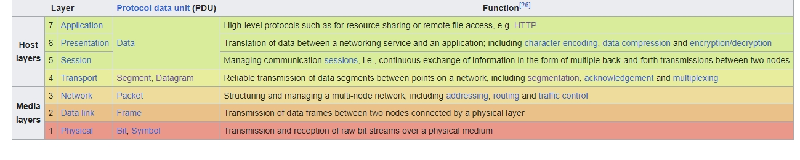
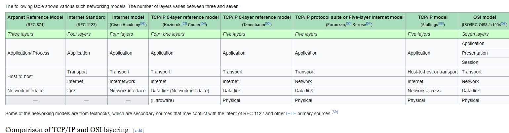

# UT1. MODELOS DE ARQUITECTURAS WEB, LENGUAJES, FRAMEWORKS Y HERRAMIENTAS

## 1.1 MODELOS DE ARQUITECTURAS WEB. 

### Modelo OSI, TCP/IP y otros


[+info](https://en.wikipedia.org/wiki/OSI_model)





## ¿Qué es la arquitectura de software?

Según esta [fuente](https://www.sei.cmu.edu/our-work/software-architecture/): 

> La arquitectura de software de un sistema representa las decisiones de diseño relacionadas con la estructura y el comportamiento general del sistema.

¿Es bastante genérico, verdad? Absolutamente. Es un tema que abarca mucho y el término se usa para hablar de muchas cosas diferentes.

La manera más sencilla de expresarlo es que la arquitectura de software se refiere a cómo organizas las cosas en el proceso de crear software. Y "cosas" aquí puede referirse a:

- *Detalles de implementación* (es decir, la estructura de carpetas de tu repositorio).
- *Decisiones de diseño de implementación* (¿renderizado del lado del servidor o del cliente? ¿Bases de datos relacionales o no relacionales?).
- *Las tecnologías que eliges* (¿REST, gRPC o GraphQL para tu API? ¿Python con Django o Node con Express para el backend, ASP.NET Core, Java Spring?).
- *Decisiones de diseño del sistema* (como si tu sistema es un monolito o está dividido en microservicios).
- *Decisiones de infraestructura* (¿alojamiento del software en las instalaciones de una empresa o en un proveedor de la nube?).

Eso implica muchas decisiones y posibilidades diferentes. Y lo que complica esto un poco más es que, dentro de estas 5 divisiones, se pueden combinar diferentes *patrones*. 

Es decir, puedo tener una API monolítica que usa REST o GraphQL, una aplicación basada en microservicios alojada en las instalaciones o en la nube, y así sucesivamente.

Para explicar mejor este embrollo, primero vamos a abordar algunos conceptos genéricos básicos. Luego, recorreremos algunas de estas divisiones, explicando los patrones de arquitectura o las elecciones más comunes que se utilizan hoy en día para construir aplicaciones.

## Conceptos importantes de arquitectura de software que debes conocer

### ¿Qué es el modelo Cliente-servidor?


- Cliente-servidor es un modelo que estructura las tareas o cargas de trabajo de una aplicación entre un proveedor de recursos o servicios (servidor) y un solicitante de servicios o recursos (cliente).

- Simplificando, el cliente es la aplicación que solicita algún tipo de información o realiza acciones, y el servidor es el programa que envía la información o realiza acciones según lo que haga el cliente. Normalmente mediante peticiones HTTP (GET, POST, ...)

- Los clientes suelen estar representados por aplicaciones frontend que funcionan en la web o en aplicaciones móviles (aunque también existen otras plataformas y las aplicaciones backend pueden actuar como clientes). Los servidores son generalmente aplicaciones backend.

- Para ilustrarlo con un ejemplo, imagina que estás entrando a tu red social favorita. Cuando introduces la URL en tu navegador y presionas enter, tu navegador está actuando como la aplicación cliente y enviando una solicitud al servidor de la red social, que responde enviándote el contenido del sitio web.

- La mayoría de las aplicaciones hoy en día utilizan un modelo cliente-servidor. El concepto más importante a recordar es que los clientes solicitan recursos o servicios que el servidor realiza.

Otro concepto importante es que los clientes y servidores son parte del mismo sistema, pero cada uno es una aplicación/programa por sí mismo. Esto significa que pueden desarrollarse, alojarse y ejecutarse por separado.


### ¿Qué son las APIs?

Acabamos de mencionar que los clientes y servidores son entidades que se comunican entre sí para solicitar y responder cosas. La forma en que estas dos partes normalmente se comunican es a través de una **API (interfaz de programación de aplicaciones)**.

- Una API no es más que un conjunto de reglas definidas que establece cómo una aplicación puede comunicarse con otra. Es como un contrato entre las dos partes que dice: "Si me envías A, siempre responderé B. Si me envías C, siempre responderé D..." y así sucesivamente.

- Al tener este conjunto de reglas, el cliente sabe exactamente lo que debe solicitar para completar una tarea, y el servidor sabe exactamente lo que el cliente va a requerir cuando deba realizarse una acción.

- Existen diferentes formas en que una API puede ser implementada. Las más comunes son REST, SOAP, gRPC y GraphQL.

En cuanto a cómo se comunican las APIs, el protocolo más utilizado es HTTP y el contenido se intercambia en formato JSON o XML. Sin embargo, otros protocolos y formatos de contenido también son posibles.

### Página web dinámica¶

Si la página web únicamente contiene HTML + CSS se considera una página estática. Para generar una página dinámica, donde el contenido cambia, a día de hoy tenemos dos alternativas:

- Utilizar un lenguaje de servidor que genere el contenido, ya sea mediante el acceso a una BD o servicios externos.
- Utilizar servicios REST de terceros invocados desde JS.


Las tecnologías empleadadas (y los perfiles de desarrollo asociados) para la generación de páginas dinámicas son:

| Perfil  | Herramienta   | Tecnología |
|---|---|---|
|  Frontend / cliente | Navegador  | HTTP/CSS/JS  |
|  Backend / servidor |  Servidor Web + BD | .NET, JAVA, Python, JS, PHP, Rust |

> En las ofertas de trabajo cuando hacen referencia a un Full-stack developer, están buscando un perfil que domina tanto el front-end como el back-end.

### ¿Qué es la modularidad?

Cuando hablamos de **modularidad** en la arquitectura de software, nos referimos a la práctica de dividir cosas grandes en piezas más pequeñas. Esta práctica de descomponer se realiza para simplificar aplicaciones o bases de código grandes.

La modularidad tiene las siguientes ventajas:

- Es útil para dividir responsabilidades y características, lo que ayuda con la visualización, comprensión y organización de un proyecto.

- El proyecto tiende a ser más fácil de mantener y menos propenso a errores y fallos cuando está claramente organizado y subdividido.

- Si tu proyecto está subdividido en muchas piezas diferentes, cada una puede trabajarse y modificarse por separado e independientemente, lo cual es muy útil en muchos casos.

>  la modularidad o la práctica de subdividir cosas es una parte fundamental de lo que es la arquitectura de software. Así que ten este concepto presente; se volverá más claro a medida que avancemos con algunos ejemplos. 

Hablemos de algunas arquitecturas:

### ARQUITECTURA EN CAPAS

#### Arquitectura de 3 capas
Hay que distinguir entre capas físicas (tier) y capas lógicas (layer).


##### Tier

- Capa física de una arquitectura. Supone un nuevo elemento hardware separado físicamente. Las capas físicas más alejadas del cliente están más protegidas, tanto por firewalls como por VPN.

Ejemplo de arquitectura en tres capas físicas (3 tier):

- Servidor Web
- Servidor de Aplicaciones
- Servidor de base de datos


#### Layer

- En cambio, las capas lógicas (layers) organizan el código respecto a su funcionalidad:

* Presentación
* Negocio / Aplicación / Proceso
* Datos / Persistencia

Como se observa, cada una de las capas se puede implementar con diferentes lenguajes de programación y/o herramientas.


#### Existe Arquitectura en N-Capas:


> No confundir las capas con la cantidad de servidores. Actualmente se trabaja con arquitecturas con múltiples servidores en una misma capa física mediante un cluster, para ofrecer tolerancia a errores y escalabilidad horizontal.

### Single Page Application

- A día de hoy, gran parte del desarrollo web está transicionando de una arquitectura web cliente-servidor clásica donde el cliente realiza una llamada al backend, por una arquitectura SPA donde el cliente gana mucho mayor peso y sigue una programación reactiva que accede a servicios remotos REST que realizan las operaciones (comunicandose mediante JSON).


## Arquitectura Monolítica (o Monolito)

> En un diseño de programación de computadoras, se define un dominio delineando un conjunto de requisitos, terminología y funcionalidad comunes para cualquier programa de software construido para resolver un problema en el área de la programación de computadoras, conocido como ingeniería de dominio. La palabra "dominio" también se toma como sinónimo de dominio de aplicación


### Ejemplo:

Tenemos una aplicación llamada MyFlix y será una aplicación de transmisión de video típica, en la que el usuario podrá ver películas, series, documentales, etc. El usuario podrá usar la aplicación en navegadores web, en una aplicación móvil y también en una aplicación de TV.

Los principales servicios incluidos en nuestra aplicación serán: 

- la autenticación (para que las personas puedan crear cuentas, iniciar sesión, etc.)
- los pagos (para que las personas puedan suscribirse y acceder al contenido... Porque no pensabas que todo esto era gratis, ¿verdad? ) 

- El streaming, por supuesto (para que la gente pueda ver realmente lo que está pagando).

Un bosquejo rápido de nuestra arquitectura podría verse así:


## Arquitectura de Microservicios


### Ejemplo

Así que resulta que MyFlix tiene éxito. Acabamos de estrenar la última temporada de "Kobra Key", que es una increíble serie de ciencia ficción sobre raperos adolescentes, y nuestra película "Agent 404" (sobre un agente secreto que se infiltra en una empresa simulando ser un programador senior pero que en realidad no sabe nada de código) está batiendo todos los récords...

- Estamos recibiendo decenas de miles de nuevos usuarios cada mes de todo el mundo, lo cual es excelente para nuestro negocio, pero no tanto para nuestra aplicación monolítica.

- Últimamente hemos estado experimentando retrasos en los tiempos de respuesta del servidor, y a pesar de que hemos escalado verticalmente el servidor (le hemos puesto más RAM y GPU) el pobre no parece ser capaz de soportar la carga que está soportando.

- Además, hemos seguido desarrollando nuevas funciones en nuestro sistema (como una herramienta de recomendación que lee las preferencias del usuario y recomienda películas que se adaptan al perfil del usuario) y nuestra base de código está empezando a parecer enorme y muy compleja de trabajar.

Analizando este problema en profundidad, hemos encontrado que la función que más recursos consume es el streaming, mientras que otros servicios como la autenticación y los pagos no representan una carga muy grande.

Para resolver este problema, implementaremos una arquitectura de microservicios que tendrá un aspecto similar al siguiente:


## 1.2 FRAMEWORKS BACKEND

# Tecnologías Backend

El backend es el motor que impulsa la lógica de una aplicación, gestionando la interacción con bases de datos, la autenticación de usuarios, el manejo de la lógica de negocio y la comunicación con el frontend a través de APIs. Es el cerebro detrás de cualquier aplicación web o móvil, donde la mayor parte del procesamiento y almacenamiento ocurre.

## 1. **Lenguajes de Programación Backend**
Existen diversos lenguajes de programación que se utilizan en el desarrollo backend, cada uno con sus ventajas dependiendo del tipo de proyecto y su escala. Los más destacados son:

- **Python**: Un lenguaje popular por su sintaxis clara y sus poderosos frameworks como Django y Flask. Es ideal para el desarrollo rápido de aplicaciones web y cuenta con una vasta comunidad de soporte.
- **JavaScript (Node.js)**: Con Node.js, se puede usar JavaScript en el servidor, permitiendo unificar el frontend y backend bajo un mismo lenguaje. Node.js es asíncrono y eficiente, especialmente en aplicaciones en tiempo real como chats y servicios de streaming.
- **Java**: Un lenguaje robusto, conocido por su estabilidad y escalabilidad en aplicaciones empresariales. Java es comúnmente usado en bancos y grandes corporaciones, con frameworks como Spring que facilitan el desarrollo de aplicaciones de gran envergadura.
- **PHP**: Uno de los lenguajes más utilizados en la web, especialmente en aplicaciones como WordPress. PHP tiene una gran comunidad y un ecosistema amplio, aunque está perdiendo popularidad frente a lenguajes más modernos.
- **C# y .NET**: Desarrollado por Microsoft, es uno de los lenguajes y frameworks más poderosos para el desarrollo backend. La plataforma **.NET** es ampliamente utilizada en aplicaciones empresariales, y ofrece una robustez similar a Java, con una integración perfecta en entornos Windows y Azure.
- **Ruby**: Utilizado principalmente con Ruby on Rails, es conocido por su enfoque en la simplicidad y la rapidez de desarrollo, ideal para startups y prototipos rápidos.

## 2. **Frameworks Backend**
Los frameworks son herramientas que proporcionan una estructura estándar para desarrollar aplicaciones backend, haciendo el desarrollo más eficiente y escalable. Algunos frameworks populares incluyen:

- **Django (Python)**: Framework de alto nivel que facilita el desarrollo rápido de aplicaciones web, con un enfoque en la seguridad y la escalabilidad. Sigue el patrón MVC (Modelo-Vista-Controlador).
- **Flask (Python)**: Framework minimalista que permite construir aplicaciones pequeñas y sencillas, brindando flexibilidad y control total al desarrollador.
- **Express (Node.js)**: El framework más utilizado en Node.js, conocido por su simplicidad y flexibilidad, lo que permite crear aplicaciones web y APIs de manera rápida y eficiente.
- **Spring (Java)**: Un framework robusto y modular para el desarrollo de aplicaciones empresariales en Java. Ofrece un ecosistema completo que abarca desde la seguridad hasta el manejo de bases de datos.
- **ASP.NET Core (C#)**: El framework backend principal para aplicaciones en .NET. Es multiplataforma y permite el desarrollo de aplicaciones web de alto rendimiento. Integra funcionalidades avanzadas como middleware, soporte para APIs RESTful y servicios en la nube de Azure.
- **Ruby on Rails (Ruby)**: Ofrece una gran productividad gracias a su enfoque en "Convención sobre Configuración", que permite a los desarrolladores seguir buenas prácticas sin tener que hacer configuraciones manuales.

## 3. **Bases de Datos**
El backend es responsable de interactuar con las bases de datos, donde se almacenan y gestionan los datos de la aplicación. Las bases de datos se pueden dividir en dos grandes categorías:

- **Bases de datos relacionales**: Utilizan tablas y SQL para gestionar datos. Son adecuadas para aplicaciones donde la consistencia y las relaciones entre datos son críticas.
  - **MySQL**: Una de las bases de datos relacionales más populares, utilizada ampliamente en aplicaciones web.
  - **PostgreSQL**: Una opción potente y extensible, con soporte para datos complejos y transacciones avanzadas.
  - **SQL Server**: Utilizado comúnmente en entornos empresariales y aplicaciones desarrolladas con .NET.
  
- **Bases de datos NoSQL**: Adecuadas para grandes volúmenes de datos no estructurados o semi-estructurados. Utilizan diferentes modelos de datos como documentos, grafos o pares clave-valor.
  - **MongoDB**: Una base de datos NoSQL orientada a documentos, ideal para aplicaciones que manejan datos JSON dinámicos.
  - **Redis**: Un almacén de datos en memoria que se utiliza para mejorar el rendimiento mediante el almacenamiento en caché.
  - **Cassandra**: Un sistema de base de datos distribuida que maneja grandes volúmenes de datos y ofrece alta disponibilidad.

## 4. **APIs**
Las APIs son esenciales para la comunicación entre el backend y otras aplicaciones o el frontend. Los dos enfoques más utilizados son:

- **REST (Representational State Transfer)**: Un estilo arquitectónico que utiliza HTTP para interactuar con recursos a través de operaciones estándar como GET, POST, PUT y DELETE. Es simple y ampliamente adoptado.
- **GraphQL**: Una tecnología más reciente que permite a los clientes definir exactamente qué datos necesitan, reduciendo la sobrecarga de red y optimizando el rendimiento.

## 5. **Servidores Web**
Un servidor web es el software que gestiona las solicitudes HTTP y las envía a la lógica backend para su procesamiento. Los servidores más utilizados incluyen:

- **Apache**: Uno de los servidores web más utilizados en el mundo, conocido por su modularidad y extensibilidad.
- **Nginx**: Popular por su capacidad para manejar muchas conexiones simultáneas con un bajo uso de recursos, es ideal para aplicaciones que requieren alta disponibilidad.
- **Kestrel (ASP.NET Core)**: Un servidor web ligero y rápido que viene integrado en aplicaciones .NET Core. Está optimizado para el rendimiento en entornos multiplataforma.

## 6. **Autenticación y Autorización**
Las aplicaciones modernas deben garantizar que los usuarios y los servicios estén autenticados y autorizados para acceder a recursos específicos. Algunas técnicas comunes incluyen:

- **JWT (JSON Web Tokens)**: Utilizado para transmitir información entre partes de manera segura, es muy común en aplicaciones web y móviles.
- **OAuth 2.0**: Un estándar de autorización que permite a los usuarios otorgar acceso limitado a sus recursos sin compartir sus credenciales.
- **IdentityServer**: Una implementación de código abierto para gestionar la autenticación y autorización en aplicaciones ASP.NET Core, compatible con OpenID Connect y OAuth 2.0.

## 7. **DevOps e Infraestructura**
El backend moderno está estrechamente relacionado con prácticas de DevOps e infraestructuras automatizadas que aseguran un desarrollo continuo y un despliegue rápido.

- **Contenedores (Docker)**: Permiten a los desarrolladores empaquetar aplicaciones y sus dependencias en un contenedor que se puede ejecutar de manera consistente en cualquier entorno.
- **Orquestación de contenedores (Kubernetes)**: Una plataforma para automatizar el despliegue, la escalabilidad y la operación de aplicaciones en contenedores.
- **CI/CD (Integración Continua/Despliegue Continuo)**: Automación de las pruebas, construcción y despliegue del código, asegurando que cada cambio se integre sin errores y se publique rápidamente.
- **Azure/AWS/GCP**: Proveedores de servicios en la nube que ofrecen soluciones escalables y seguras para aplicaciones backend, como servidores, bases de datos, almacenamiento y herramientas de análisis.


## 1.3 HERRAMIENTAS DE DESARROLLO

1) [Customizar Atajos Visual Studio](https://learn.microsoft.com/en-us/visualstudio/ide/identifying-and-customizing-keyboard-shortcuts-in-visual-studio?view=vs-2022)


2) [To AI OR Not to AI](https://stackoverflow.blog/2023/06/14/hype-or-not-developers-have-something-to-say-about-ai/)

## 1.4 FUNDAMENTOS DE PROGRAMACIÓN BACKEND

### LENGUAJE C# 

#### REFERENCIA DEL LENGUAJE C#
[Referencia](https://learn.microsoft.com/es-es/dotnet/csharp/language-reference/)

El lenguaje C# o también llamado csharp es el más utilizado en la plataforma .net. En la que también coexisten, F# y Visual Basic. 

No obstante, C# es el que se utiliza mucho para todos los proyectos de .net.

Veremos los fundamentos con varios ejemplos en clase que hagamos y luego iremos haciendo prácticas.


- [Problema con double Misiles Patriot](https://www-users.cse.umn.edu/~arnold/disasters/patriot.html)

- [Misiles Patriot sin ese fallo](https://archive.ph/2023.06.11-132200/https://www.wsj.com/amp/articles/u-s-patriot-missile-is-an-unsung-hero-of-ukraine-war-db6053a0)

### Ejercicios y Prácticas

- [Repositorio 1 de ejercicios de clase](https://github.com/docenciait/EjerciciosDeClase)

#### Ejercicio 1:

Escribe un programa en C# que tome tres números (x, y, z) como entrada y muestre los resultados de las siguientes expresiones:

Test Data:

Primer número:  4
Segundo número:  6
Tercer número:  2

Salida esperada:

4, 6 and 2, (x+y)·z is 20 and x·y + y·z is 36 

#### Ejercicio 2
 Write a C# program that takes a number as input and displays a rectangle of 3 columns wide and 5 rows tall using that digit.
 Escribe un programa que tome un número como entrda y muestre un rectángulo de 3 columnas de ancho y 5 filas de alto utilizando ese dígito:

```
Test Data:
Enter a number: 5
Expected Output:
555
5 5
5 5
5 5
555
``` 

### Ejercicio 3
Crea una aplicación de consola llamada Ej3Numbers que muestra la salida de los números de bytes en memoria de cada uno de los siguientes tipos en su máximo y mínimo valor: sbyte, byte, short, ushort, int, uint, long, ulong, Int128, UInt128, Half, float, double, y decimal.

Output:


### Práctica 1: Calculadora con Menú

- Descripción:

Se debe desarrollar un programa en C# 12 que muestre un menú en consola con las siguientes opciones:

- Sumar
- Restar
- Multiplicar
- Dividir
- Salir

Cada opción pedirá dos números por teclado al usuario y mostrará el resultado de la operación seleccionada. Se deben utilizar métodos para cada función de la calculadora.

 El programa debe continuar ejecutándose hasta que el usuario seleccione la opción de "Salir".

---

### Práctica 2

Práctica: Sistema Simplificado de Uber 

- Objetivos:

Implementar un sistema que simule el funcionamiento básico de Uber.
Aplicar principios de programación orientada a objetos, como herencia, composición y polimorfismo.

Gestionar la creación de viajes, la asignación de conductores y la interacción con pasajeros.

* Requisitos:

- Clases Principales:

- Persona: Clase base con propiedades Nombre, Edad, y métodos comunes como MostrarDatos().
- Conductor: Hereda de Persona y tiene propiedades adicionales como Auto y 
- Disponibilidad. Implementa métodos como AceptarViaje().
- Pasajero: Hereda de Persona y tiene métodos para SolicitarViaje() y CalificarConductor().
- Auto: Contiene propiedades como Marca, Modelo, Matricula, y Capacidad. Está asociado a un Conductor.
- Viaje: Incluye información sobre el punto de origen, destino, distancia, costo, y el conductor asignado.

* Funcionalidades Básicas:

- Los pasajeros pueden solicitar viajes.
- Los conductores aceptan o rechazan viajes.
- Se calcula el costo del viaje basado en la distancia.
- Los pasajeros califican a los conductores después del viaje.

Diseño UML Básico:

La clase Viaje está asociada tanto a Conductor como a Pasajero.
Los conductores tienen un auto asociado.

Un pasajero puede solicitar múltiples viajes, pero un viaje tiene un solo pasajero y conductor.

```UML
+-----------------+
|     Persona     |
+-----------------+
| - Nombre        |
| - Edad          |
+-----------------+
| + MostrarDatos()|
+-----------------+
        ^
        |
+-----------------+    +--------------------+
|   Conductor     |    |     Pasajero        |
+-----------------+    +--------------------+
| - Auto: Auto    |    |                    |
| - Disponibilidad|    |                    |
+-----------------+    +--------------------+
| + AceptarViaje()|    | + SolicitarViaje()  |
+-----------------+    | + CalificarCond.() |
                       +--------------------+

+-----------------+
|      Auto       |
+-----------------+
| - Marca         |
| - Modelo        |
| - Matricula     |
| - Capacidad     |
+-----------------+

+-----------------+
|      Viaje      |
+-----------------+
| - Origen        |
| - Destino       |
| - Distancia     |
| - Costo         |
| - Conductor     |
| - Pasajero      |
+-----------------+

```