# UNIDAD 2. LENGUAJE DE SERVIDOR. APLICACIONES

## Introducción

### Qué es .NET CORE

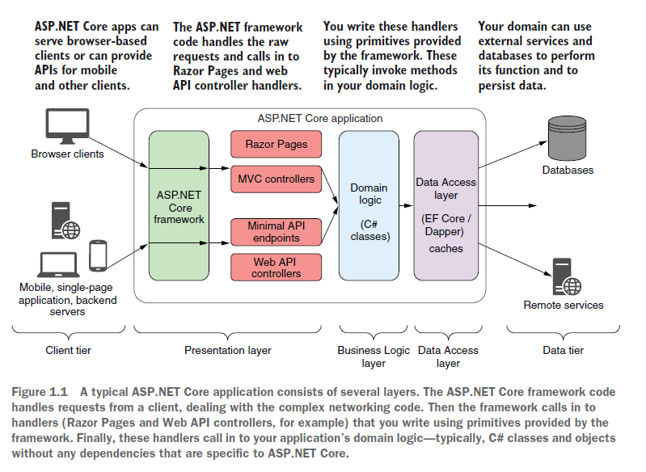 

### Cómo funcionan las páginas dotnet

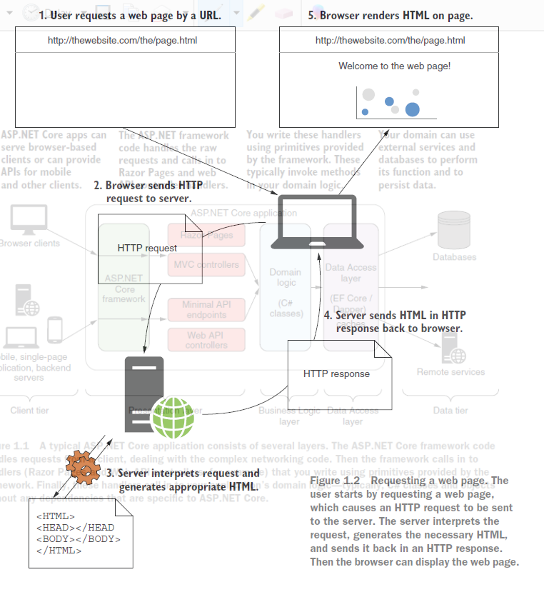


### Cómo se estructura una página


### Cuál es flujo de una apliación web .net


### Qué podemos hacer con .NET CORE

- **APIs mínimas**: APIs HTTP simples que pueden ser consumidas por aplicaciones móviles o aplicaciones de una sola página basadas en navegador.
- **APIs web**: Un enfoque alternativo para construir APIs HTTP que agrega más estructura y características en comparación con las APIs mínimas.
- **APIs gRPC**: Se utilizan para crear APIs binarias eficientes para la comunicación entre servidores usando el protocolo gRPC.
- **Razor Pages**: Se utilizan para construir aplicaciones basadas en páginas renderizadas en el servidor.
- **Controladores MVC**: Similar a Razor Pages. Las aplicaciones de controladores de Modelo-Vista-Controlador (MVC) son para aplicaciones basadas en servidor, pero sin el paradigma basado en páginas.
- **Blazor WebAssembly**: Un marco de aplicación de una sola página basado en el navegador que utiliza el estándar WebAssembly, similar a los marcos de JavaScript como Angular, React y Vue.
- **Blazor Server**: Se utiliza para construir aplicaciones con estado, renderizadas en el servidor, que envían eventos de interfaz de usuario y actualizaciones de página a través de WebSockets para proporcionar la sensación de una aplicación de una sola página del lado del cliente, pero con la facilidad de desarrollo de una aplicación renderizada en el servidor.

### Páginas con estilos modernos de gran rendimiento

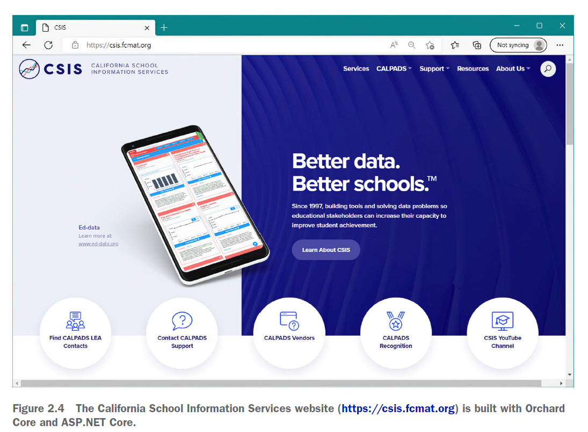

### Funcionamiento de las APIs

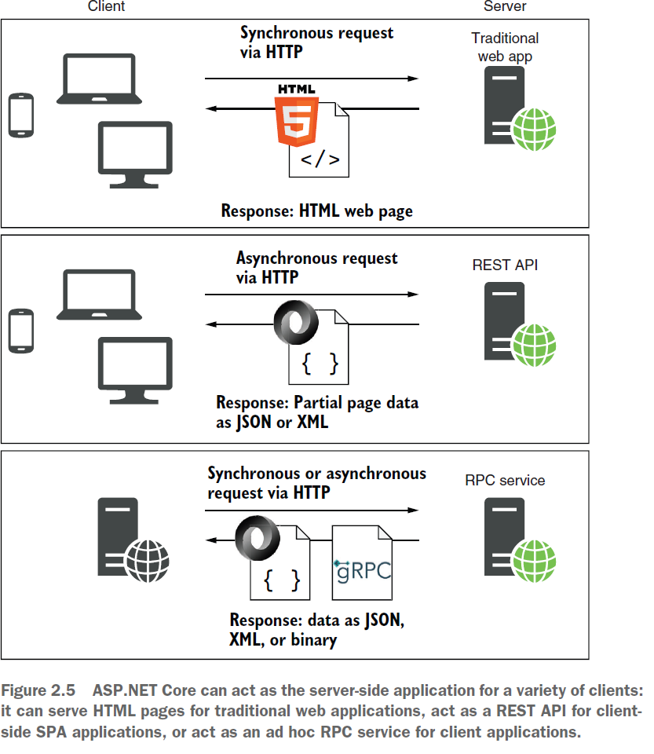

### Cómo está integrado dotnet en los servidore de aplicaciones/web

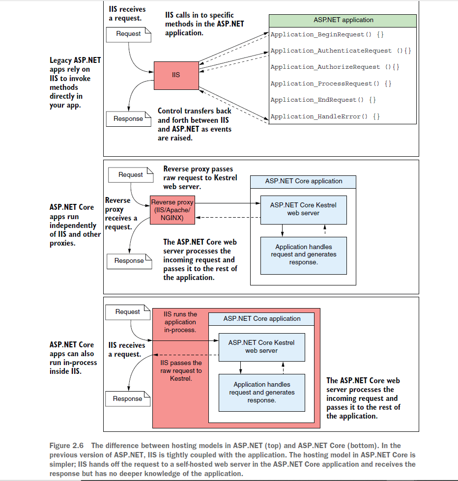

## Creación de aplicaciones web .net (api mínima)

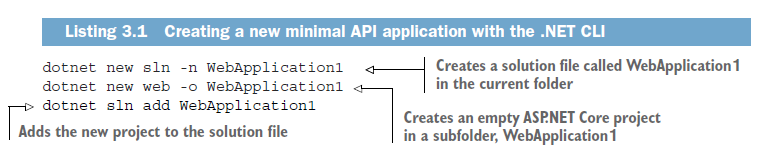

**Comandos de ejecución**

- dotnet restore
- dotnet build
- dotnet run

Cada uno de estos comandos debe ejecutarse dentro de la carpeta de tu proyecto y actuará solo sobre ese proyecto. 
Excepto donde se indique explícitamente, este es el caso para todos los comandos de la CLI de .NET. 

La mayoría de las aplicaciones ASP.NET Core tienen dependencias en varias bibliotecas externas, 
que se gestionan a través del gestor de paquetes NuGet. Estas dependencias se enumeran en el proyecto, 
pero los archivos de las bibliotecas en sí no están incluidos. Antes de que puedas compilar y ejecutar tu aplicación, 
debes asegurarte de que haya copias locales de cada dependencia en tu máquina. 

El primer comando, `dotnet restore`, asegura que las dependencias NuGet de tu aplicación se descarguen y que los archivos 
se referencien correctamente en tu proyecto.

Los proyectos ASP.NET Core enumeran sus dependencias en el archivo `.csproj` del proyecto, un archivo XML que lista 
cada dependencia como un nodo `PackageReference`. Cuando ejecutas `dotnet restore`, se usa este archivo para establecer 
qué paquetes NuGet descargar. Cualquier dependencia listada estará disponible para su uso en tu aplicación.

El proceso de restauración generalmente ocurre de manera implícita cuando compilas o ejecutas tu aplicación, 
como se muestra en la siguiente figura, pero a veces puede ser útil ejecutarlo explícitamente, 
como en los pipelines de integración continua.

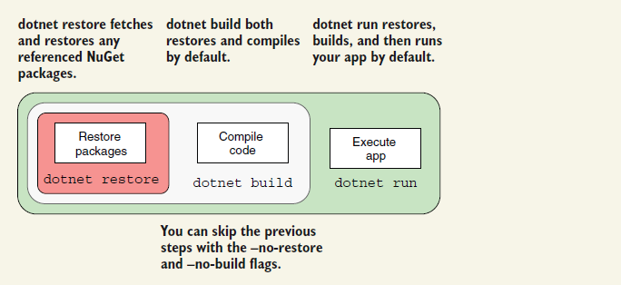

Si no quieres restaurar o construir, usar flags: ```--no-restore``` y ```--no-build```


### Paquetes Nuget

```dotnet add package Newtonsoft.Json```

```
<Project Sdk="Microsoft.NET.Sdk.Web">
	<PropertyGroup>
		<TargetFramework>net7.0</TargetFramework>
			<Nullable>enable</Nullable>
		<ImplicitUsings>enable</ImplicitUsings>
	</PropertyGroup>
	<ItemGroup>
		<PackageReference Include="NewtonSoft.Json" Version="13.0.1" />
	</ItemGroup>
</Project>
```

### Primera aplicación

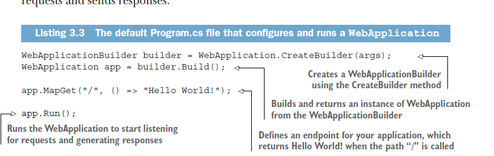

### Middleware

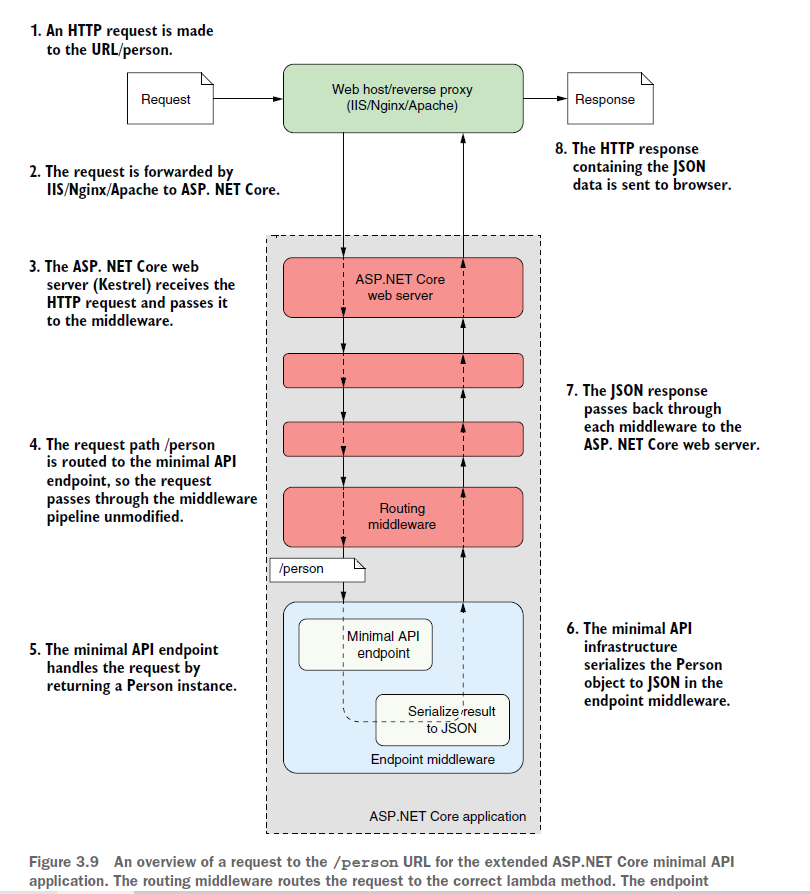

### Landing page

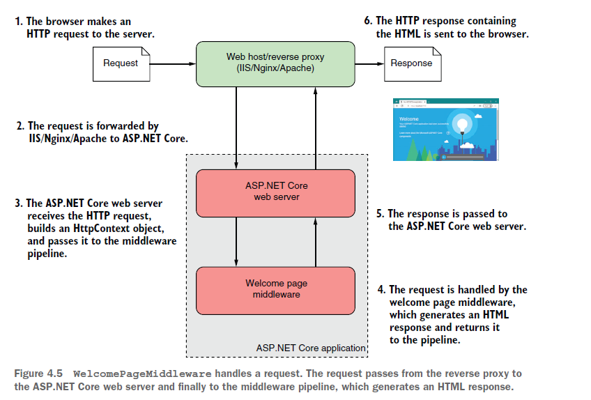

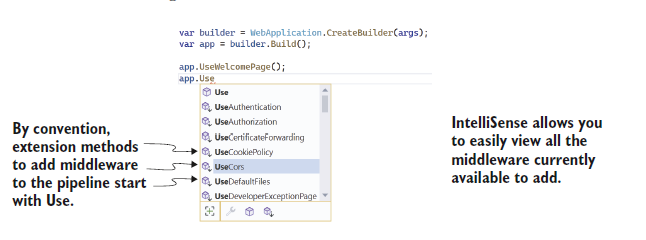